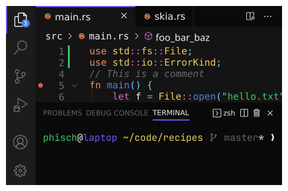

# phocus

Is a color scheme that comes with clean, opinionated and technical debt free implementations (themes) for various tools.

      

            

           

                             

 

Check out the [phocus page](https://phocus.github.io/) for detailed information about the color scheme and more examples. And browse the repositories below for theme implementations.